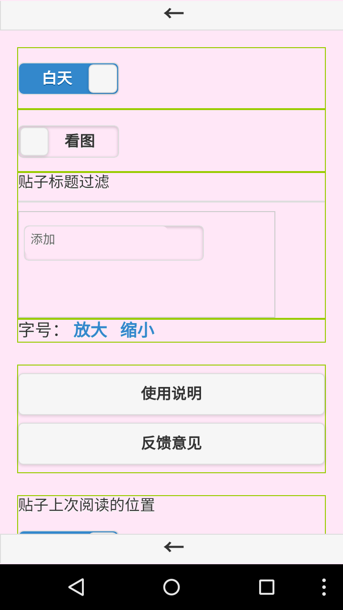

hjj_firefox_os
==============

红晋江 http://bbs.jjwxc.net 看贴

## 安装

### firefoxos

在firefox market直接安装 [HJJ-firefoxos](https://marketplace.firefox.com/app/hjj/) 

### android

法一：

先安装firefox，打开firefox，访问firefox market安装：[HJJ-firefoxos](https://marketplace.firefox.com/app/hjj/)

法二：

注意：android 5, cm 12 rom 测试速度正常。其他版本未测试。

安装phonegap打包的 android 版本：[HJJ-phonegap](https://build.phonegap.com/apps/1033213/share)，[apk文件](https://build.phonegap.com/apps/1033213/download/android/)

## 主页

顶部按钮：刷新；版块列表；设置

底部按钮：跳转；收藏的版块；主页；收藏的帖子；访问历史

## 版块

顶部按钮：子版块；热贴；发帖；搜索

底部按钮：跳转；收藏的版块；主页；收藏的帖子；访问历史

## 贴子

顶部按钮：上次标记的楼层；分享；推送到kindle；跳转；更多操作

楼层按钮： 1) 引用此楼内容回帖; 2) 不引用内容直接回复此楼; 3) 标记当前楼层

底部首层按钮： 0）倒序；1）只看楼主；2）只看图；3）按字数脱水；4）显示所有楼层

底部二层按钮： 0）跳到顶部；1）往前跳Ｎ楼；2）返回本版；3）往后跳Ｎ楼；4）跳到底部

### 事件

底部 左/右 侧单击：上一页/下一页

中部 中间 单击：显示/隐藏 底栏

## 黑夜模式

## 搜索

## 版块列表

## 跳转到指定大院/门牌

## 设置

## 绑定腾讯微博，支持贴图

浏览器打开 http://test.open.t.qq.com ，选择授权方式为``oauth2.0``

把授权信息中的``openid``、``appkey``、``access_token``填入app设置页面

## 推送当前帖子到kindle

用于文库看文。。。

需要搭建在线小说处理服务，参考：[loadxs](https://github.com/abbypan/loadxs)

假设搭建的服务域名为 abc.xxx.com，服务邮箱为 kindle@xxx.com

直接将该域名填入设置页面

并在 amazon 设置允许  kindle@xxx.com 邮箱推送即可

# changelog

v0.8.5

修复：楼层跳转、点击翻页

移除功能：发贴、回贴——反正从来也不用。。。

v0.8.4

android 5.1 , cm rom 下测试，开贴速度基本正常

去掉回贴功能，反正基本不用

优化帖子打开速度，fastbutton

v0.8 

新增功能：上传图片（调用腾讯微博接口）

新增功能：记住默认子版块，例如打开XQ只显示贴图区

新增功能：记住贴子默认阅读喜好，例如只看图/只看楼主/自动脱水，刷图/看文专用

bug fix : 左边栏滑出盖住原页面

bug fix : 4寸屏幕手机无法完整显示贴子页底部按钮
