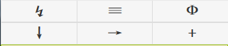

hjj_firefox_os
==============

红晋江 http://bbs.jjwxc.net 看贴

firefox market 地址：[HJJ](https://marketplace.firefox.com/app/hjj/)

phonegap 打包的 android apk 地址：[HJJ-phonegap](https://build.phonegap.com/apps/1033213/share)

## 主页

顶部按钮：1）跳转到指定大院/门牌；2）版块列表、或返回主页；3）设置

底部按钮：1）收藏的版块；2）收藏的贴子；3）最近访问记录

## 版块

顶部首行按钮：1）跳转到指定大院/门牌；2）版块列表、或返回主页；3）搜索

顶部第2行按钮：1）子版块；2）加精/套红/加星；3）发贴

## 贴子

顶部首行按钮：1）跳转到指定大院/门牌；2）返回本版；3）回帖

基础按钮：1）缓存；2）收藏；3）跳转到上一次标记的楼层；4）刷新

共享按钮：1）标签编辑；2）分享到weibo；3）推送到kindle

楼层按钮：1）引用此楼内容，回帖；2）直接回帖；3）标记当前楼层

### 事件

底部 左/右 侧单击：上一页/下一页

底部 左/右 侧双击：往 前/后 跳转N楼

底部 左/右 侧长按：跳转到 顶部/底部

底部 中间长按：跳转到指定楼层

## 黑夜模式

## 搜索

## 版块列表

## 跳转到指定大院/门牌

