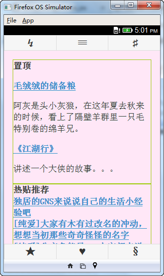
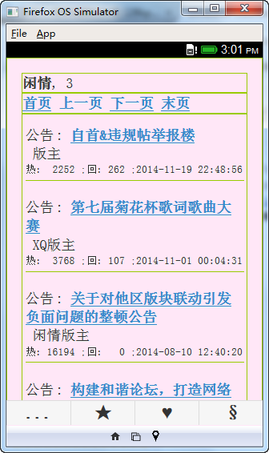
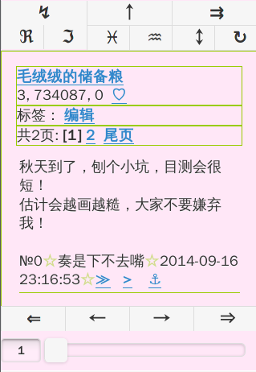
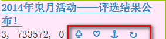
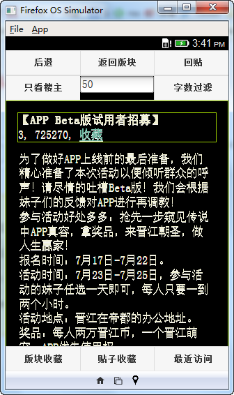
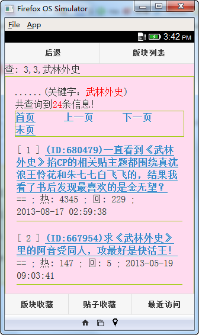
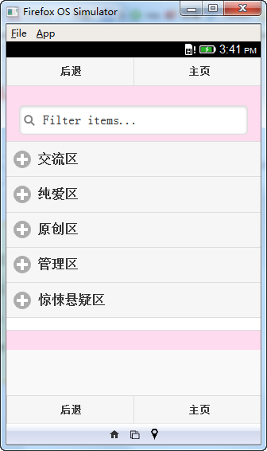
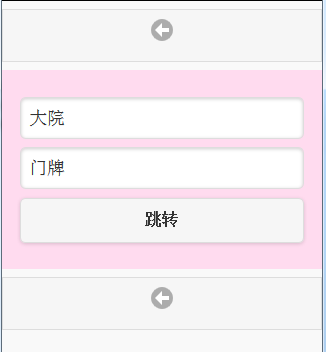

hjj_firefox_os
==============

红晋江 http://bbs.jjwxc.net 看贴

firefox 版本：[HJJ-firefoxos](https://marketplace.firefox.com/app/hjj/)

android 版本（基于phonegap打包）：[HJJ-phonegap](https://build.phonegap.com/apps/1033213/share)

## 主页

顶部按钮：1）跳转到指定大院/门牌；2）版块列表；3）设置

底部按钮：1）收藏的版块；2）收藏的贴子；3）最近访问记录

## 版块

顶部按钮1：1）跳转到指定大院/门牌；2）版块列表；3）搜索

顶部按钮2：1）子版块；2）贴子类型；3）发帖

## 贴子

顶部按钮：1）跳转到指定楼层；2）返回本版；3）回帖

楼层按钮：

1) 引用此楼内容回帖; 2) 不引用内容直接回复此楼

3) 跳转到 顶部; 4) 跳转到底部

5) 往 前 跳转N楼; 6) 往 后 跳转N楼

7) 标记当前楼层

基础按钮：1）缓存；2）收藏；3）跳转到上一次标记的楼层；4）刷新

共享按钮：1）标签编辑；2）分享到weibo；3）推送到kindle

### 事件

底部 左/右 侧单击：上一页/下一页

## 黑夜模式

## 搜索

## 版块列表

## 跳转到指定大院/门牌

## ChangeLog

2014-10-03 : 移除部分点击事件，处理滑动卡顿问题
