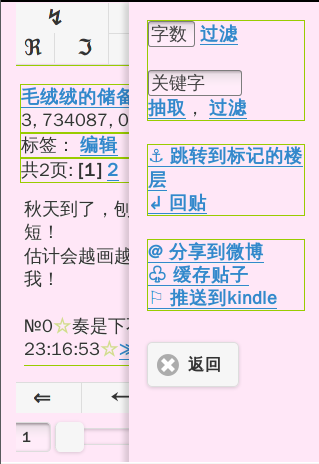
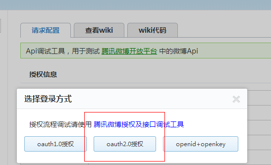
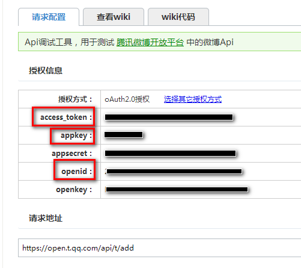
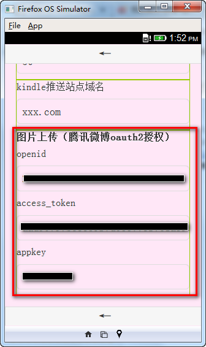

hjj_firefox_os
==============

红晋江 http://bbs.jjwxc.net 看贴

firefox 版本：[HJJ-firefoxos](https://marketplace.firefox.com/app/hjj/)

android 版本（基于phonegap打包）：[HJJ-phonegap](https://build.phonegap.com/apps/1033213/share)

## 主页

顶部按钮：1）跳转到指定大院/门牌；2）版块列表；3）设置

底部按钮：1）收藏的版块；2）收藏的贴子；3）最近访问记录

## 版块

顶部按钮1：1）跳转到指定大院/门牌；2）版块列表；3）发帖

顶部按钮2：1）子版块；2）最近新贴；3）搜索

## 贴子

顶部首层按钮：1）跳转到指定大院/门牌；2）返回本版；3）调出右边面板

顶部二层按钮：1）只看楼主；2）只看图；3）按字数脱水；4）显示所有楼层；5）倒序；6）刷新

楼层按钮： 1) 引用此楼内容回帖; 2) 不引用内容直接回复此楼; 3) 标记当前楼层

右边面板

### 事件

底部 左/右 侧单击：上一页/下一页

楼层左滑：引用此楼内容回帖; 

楼层右滑：不引用内容直接回复此楼

## 黑夜模式

## 搜索

## 版块列表

## 跳转到指定大院/门牌

## 绑定腾讯微博，支持贴图

浏览器打开 http://test.open.t.qq.com ，选择授权方式为``oauth2.0``

把授权信息中的``openid``、``appkey``、``access_token``填入app设置页面

## 推送当前帖子到kindle

用于文库看文。。。

需要搭建在线小说处理服务，参考：[loadxs](https://github.com/abbypan/loadxs)

假设搭建的服务域名为 abc.xxx.com，服务邮箱为 kindle@xxx.com

直接将该域名填入设置页面

并在 amazon 设置允许  kindle@xxx.com 邮箱推送即可
