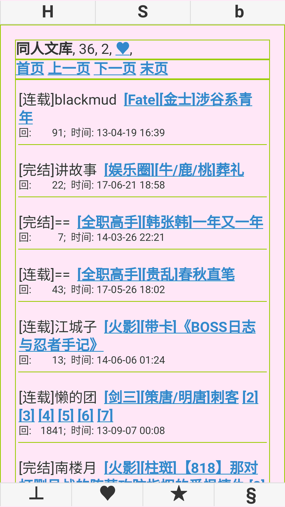
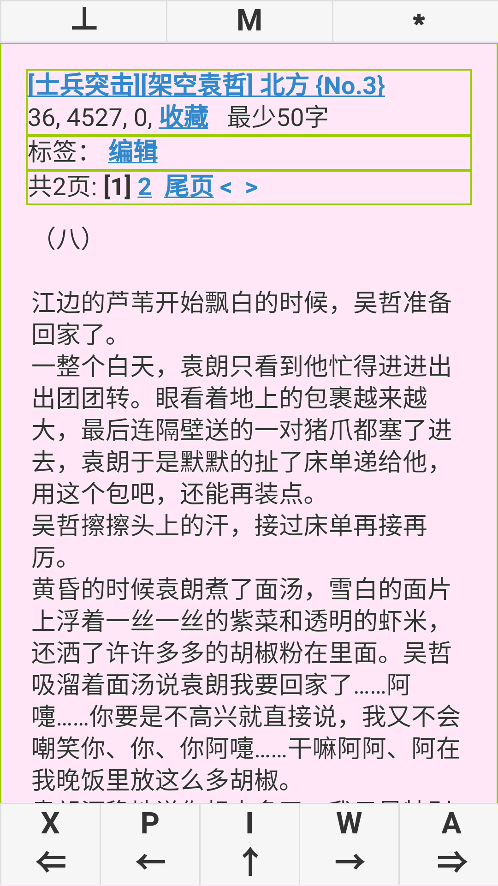
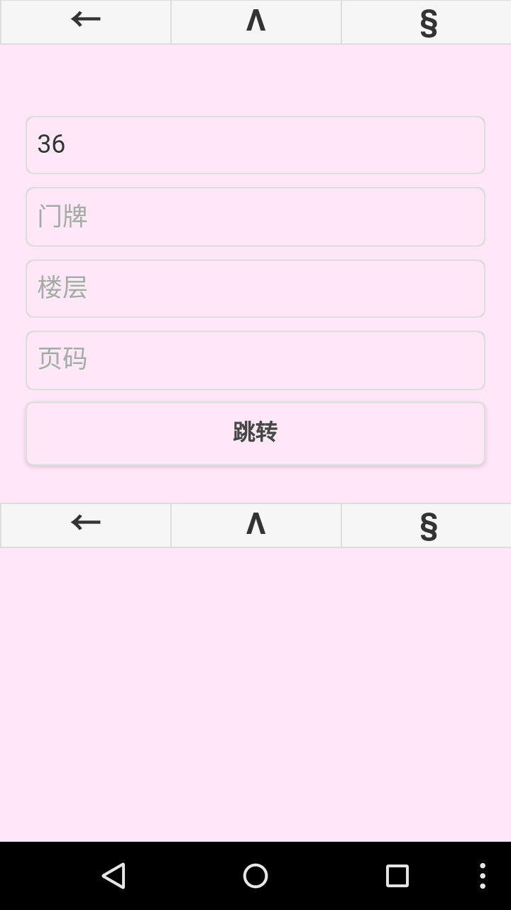

hjj_firefox_os
==============

红晋江 http://bbs.jjwxc.net 看贴

firefox 版本：[HJJ-firefoxos](https://marketplace.firefox.com/app/hjj/)

android 版本（基于phonegap打包）：[HJJ-phonegap](https://build.phonegap.com/apps/1033213/share)

## 主页

顶部按钮：1）跳转到指定大院/门牌；2）版块列表；3）设置

底部按钮：1）收藏的版块；2）收藏的贴子；3）最近访问记录

## 版块

顶部按钮：1）跳转到指定大院/门牌；2）版块列表；3）子版块

### 事件

左/右　滑动：　搜索 / 发贴

## 贴子

顶部按钮：1）跳转到指定大院/门牌；2）返回本版；3）回帖

基础按钮：1）缓存；2）收藏；3）跳转到上一次标记的楼层；4）刷新

共享按钮：1）标签编辑；2）分享到weibo；3）推送到kindle

### 事件

楼层 左/右　滑动：　直接回帖 / 引用此楼内容回帖

底部 左/右 侧单击：上一页/下一页

底部 左/右 侧双击：往 前/后 跳转N楼

底部 左/右 侧长按：跳转到 顶部/底部

底部 中间长按：跳转到指定楼层

## 黑夜模式

## 搜索

## 版块列表

## 跳转到指定大院/门牌

