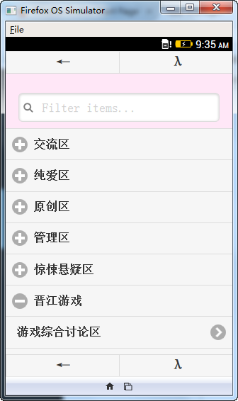

hjj_firefox_os
==============

红晋江 http://bbs.jjwxc.net 看贴

## 安装

apk安装包：[hjj.0.8.7.apk](hjj.apk)

测试环境：华为荣耀8

## 主页

顶部按钮：刷新；版块列表（废）；设置

底部按钮：跳转；收藏的版块；收藏的帖子；访问历史

## 版块

顶部按钮：热贴；搜索；子版块

底部按钮：跳转；收藏的版块；收藏的帖子；访问历史

## 贴子

顶部按钮：跳转；上次标记的楼层；更多操作

楼层按钮： 1) 引用此楼内容回帖（废）; 2) 不引用内容直接回复此楼（废）; 3) 标记当前楼层

底部首层按钮： 0）倒序；1）只看楼主；2）只看图；3）按字数脱水；4）显示所有楼层

底部二层按钮： 0）跳到顶部；1）往前跳Ｎ楼；2）返回本版；3）往后跳Ｎ楼；4）跳到底部

### 事件

底部 左/右 侧单击：上一页/下一页

中部 中间 单击：显示/隐藏 底栏

## 黑夜模式

## 搜索

## 版块列表（废）

## 跳转到指定大院/门牌

## 设置

# changelog

v0.8.7

删除回贴、贴图功能

删除推送到kindle功能

firefox market 停用，只保留android版本

v0.8.5

修复：楼层跳转、点击翻页

移除功能：发贴、回贴——反正从来也不用。。。

v0.8.4

android 5.1 , cm rom 下测试，开贴速度基本正常

去掉回贴功能，反正基本不用

优化帖子打开速度，fastbutton

v0.8 

新增功能：上传图片（调用腾讯微博接口）

新增功能：记住默认子版块，例如打开XQ只显示贴图区

新增功能：记住贴子默认阅读喜好，例如只看图/只看楼主/自动脱水，刷图/看文专用

bug fix : 左边栏滑出盖住原页面

bug fix : 4寸屏幕手机无法完整显示贴子页底部按钮
